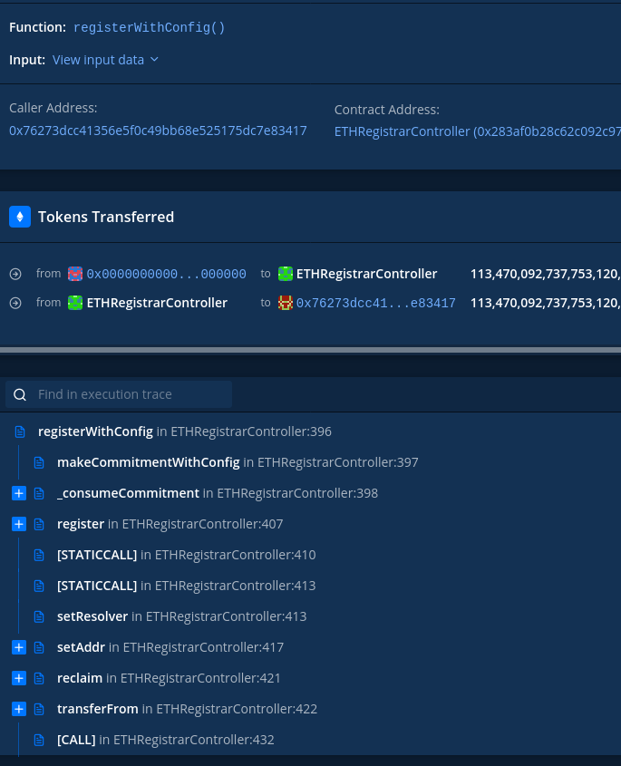

What is this?
==

This is a collection of tutorials and techniques of dealing with (actual or hypthetical)
disappearance of [https://etherscan.io](https://etherscan.io).

All links should be both printable and clickable.

This document is a part of git repository and assumes that you have it cloned.

$ETH_RPC env variable is assumed to point to Ethereum RPC of an archive node. One possible source of such
links is https://getblock.io.

Using
==

First get all the apps and install python dependencies.

```
poetry install
git submodule update --init
```

Querying current network state.
==

Let's first lookup addresses assets.

```bash
$ curl $ETH_RPC \
  -X POST \
  -H "Content-Type: application/json" \
  --data '{"method":"eth_getBalance","params":["0x76273DCC41356e5f0c49bB68e525175DC7e83417", "latest"],"id":1,"jsonrpc":"2.0"}'
  
{"jsonrpc":"2.0","id":1,"result":"0x8c3d30263799b14"}
```

Now, the returned number is supposed to represent balance in wei, but it is unreadable
and requires decoding. Run `poetry run python`

```python3

>>> from eth_utils import to_int, from_wei
>>> from_wei(to_int(0x8c3d30263799b14), 'ether')
Decimal('0.631580379974310676')
```

ETH is a great asset. But how can we lookup address ERC-20 assets?
For that you need to execute an eth_call against a node.
It will execute EVM smart contract code against contract's storage, interpreting stored data.
We can go and use it directly, with curl, but that would be troublesome.
So lets use web3 instead.
First, we will need ERC-20 ABI.
One can obtain it by compiling ERC20 contract. Many of typical contracts code is in OpenZeppelin/openzeppelin-contracts repo.
For convinience, it is cloned to $ROOT/openzeppelin-contracts.

First, lets compile it.
```bash
$ cd openzeppelin-contracts
$ npm install
$ npx hardhat compile
```

Next, lets fire up python console: `poetry run python3`

```python
>>> import os
>>> from web3 import Web3
>>> w3 = Web3(Web3.HTTPProvider(os.environ['ETH_RPC']))
>>> w3.isConnected()
True

>>> import json
>>> with open('openzeppelin-contracts/artifacts/contracts/token/ERC20/ERC20.sol/ERC20.json') as f:
        compiled_contract = json.load(f)

>>> torn = w3.eth.contract(address='0x77777FeDdddFfC19Ff86DB637967013e6C6A116C', abi=compiled_contract['abi'])
torn
<web3._utils.datatypes.Contract object at 0x7f12dccbf130>

>>> torn.all_functions()
[<Function allowance(address,address)>,
 <Function approve(address,uint256)>,
 <Function balanceOf(address)>,
 <Function decimals()>,
 <Function decreaseAllowance(address,uint256)>,
 <Function increaseAllowance(address,uint256)>,
 <Function name()>,
 <Function symbol()>,
 <Function totalSupply()>,
 <Function transfer(address,uint256)>,
 <Function transferFrom(address,address,uint256)>]

>>> torn.functions.balanceOf('0x76273DCC41356e5f0c49bB68e525175DC7e83417').call()
35892105530856853359

>>> from eth_utils import to_int, from_wei
>>> from_wei(to_int(35892105530856853359), 'ether')
Decimal('35.892105530856853359')
```

Getting contract code deployed to particular address
== 

All contract code is deployed to Ethereum and is readily available to anyone:
```bash
$ curl "$ETH_RPC" \
  -X POST \
  -H "Content-Type: application/json" \
  --data '{"method":"eth_getCode","params":["0x06012c8cf97bead5deae237070f9587f8e7a266d", "latest"],"id":1,"jsonrpc":"2.0"}'
```

Unfortunately compiled code by itself is not really useful.

How to find a corresponding source code? Try github.com (usual skills) or try
to find the code on https://sourcify.dev/  (a decentralized alternative to etherscan's
"code" tab), but it does not look very complete.

Alternatively, You can try disassembling using panoramix tool.
It's accessible via https://eveem.org or for local use.

```bash
$ cd panoramix
$ python3 -m venv env
$ . ./env/bin/activate
$ pip3 install -r requirements.txt
$ python3 -m panoramix 0xa74476443119A942dE498590Fe1f2454d7D4aC0d
```

Panoramix utilizes 4byte database to add labels to the code.

Working with a transaction hash
==

Downloading a transaction
===

If you have a tx hash, use [https://expedition.dev](https://expedition.dev) to download its details.
You will see all of the components.
Alternatively, use eth_getTransactionByHash. [https://www.quicknode.com/docs/ethereum/eth_getTransactionByHash](https://www.quicknode.com/docs/ethereum/eth_getTransactionByHash)

```bash
$ curl $ETH_RPC \
  -X POST \
  -H "Content-Type: application/json" \
  --data '{"method":"eth_getTransactionByHash","params":["0x12d681248df3fcc514cb7adfb69e5dec1ba497b4e927e637f805272bc2c5bb71"],"id":1,"jsonrpc":"2.0"}' | jq

{
  "jsonrpc": "2.0",
  "id": 1,
  "result": {
    "blockHash": "0xfe406d46bcda73466b968ee0a09bcb09fa8aa5136571fd52a5722f1934ff387f",
    "blockNumber": "0xc305f2",
    "from": "0x76273dcc41356e5f0c49bb68e525175dc7e83417",
    "gas": "0x4904c",
    "gasPrice": "0xab5d04c00",
    "hash": "0x12d681248df3fcc514cb7adfb69e5dec1ba497b4e927e637f805272bc2c5bb71",
    "input": "0xf7a1696300000000000000000000000000000000000000000000000000000000000000c000000000000000000000000076273dcc41356e5f0c49bb68e525175dc7e834170000000000000000000000000000000000000000000000000000000009679ab84608e4e28ac36eec8416b2941abb17e98ff643009c236fa201c15ec886243ae40000000000000000000000004976fb03c32e5b8cfe2b6ccb31c09ba78ebaba4100000000000000000000000076273dcc41356e5f0c49bb68e525175dc7e8341700000000000000000000000000000000000000000000000000000000000000156c65676163792d6d756c746973696777616c6c65740000000000000000000000",
    "nonce": "0x3c",
    "to": "0x283af0b28c62c092c9727f1ee09c02ca627eb7f5",
    "transactionIndex": "0xcd",
    "value": "0x2967bc482172a3",
    "type": "0x0",
    "v": "0x25",
    "r": "0xe5693e3a57af4171e05b1e5b6bd0b5956c598011a3ecfefb13c5d582b7327b7a",
    "s": "0x362d0698ba8f28f3b7df48f88d4ca7a20a88471afe3aff3ad9d8f72e5c036a76"
  }
}
```

Decoding a transaction
===

Since results contains "input" field, it's a function call.
Lets determine what function was called there.
Take the first 4 bytes of the "input" field (without the 0x).
4 bytes in question are f7a16963.
There is a great resource called https://4byte.directory.
For convinience, its database is cloned into $ROOT/4bytes.
You can use it as follows:

```bash
$ cat 4bytes/signatures/f7a16963

registerWithConfig(string,address,uint256,bytes32,address,address)
```

While first 4 bytes of 'input' field correspond to function signature,
the rest is function arguments encoded with Ethereum ABI.
Decoding can be done with a python library.
(https://eth-abi.readthedocs.io/en/latest/decoding.html)
Run `poetry run python`

```python
>>> from eth_abi import decode_abi

>>> inputA = '''0xf7a1696300000000000000000000000000000000000000000000000000000000000000
c000000000000000000000000076273dcc41356e5f0c49bb68e525175dc7e834170000000000000000000000
000000000000000000000000000000000009679ab84608e4e28ac36eec8416b2941abb17e98ff643009c236f
a201c15ec886243ae40000000000000000000000004976fb03c32e5b8cfe2b6ccb31c09ba78ebaba41000000
00000000000000000076273dcc41356e5f0c49bb68e525175dc7e83417000000000000000000000000000000
00000000000000000000000000000000156c65676163792d6d756c746973696777616c6c6574000000000000
0000000000'''
>>> input = "".join([line for line in inputA.split("\n")])
>>> abi = ['string', 'address', 'uint256', 'bytes32', 'address', 'address']
>>> list(zip(abi, decode_abi(abi, bytes.fromhex(input[10:]))))

# [('string', 'legacy-multisigwallet'),
#  ('address', '0x76273dcc41356e5f0c49bb68e525175dc7e83417'),
#  ('uint256', 157784760),
#  ('bytes32', b'F\x08\xe4\xe2\x8a\xc3n\xec\x84\x16\xb2\x94\x1a\xbb\x17\xe9\x8f\xf6C\x00\x9c#o\xa2\x01\xc1^\xc8\x86$:\xe4'),
#  ('address', '0x4976fb03c32e5b8cfe2b6ccb31c09ba78ebaba41'),
#  ('address', '0x76273dcc41356e5f0c49bb68e525175dc7e83417')]
```

This is better than nothing.
But knowing names of those arguments would be useful.
Assuming that we know that '0x283af0b28c62c092c9727f1ee09c02ca627eb7f5' belongs to ENS Registrar Controller, lets try to find its code and understand the rest.
[Searching](https://github.com/search?q=org%3Aensdomains+registerWithConfig) https://github.com/ensdomains for registerWithConfig string, reveals that registrar code is in ens-contracts repo.
For convinience it is cloned into $ROOT/ens-contracts.

```
$ grep -Rn registerWithConfig ens-contracts/contracts/
ens-contracts/contracts/ethregistrar/ETHRegistrarController.sol:28:  
   keccak256("registerWithConfig(string,address,uint256,bytes32,address,address)") ^
ens-contracts/contracts/ethregistrar/ETHRegistrarController.sol:85:  
   registerWithConfig(name, owner, duration, secret, address(0), address(0));
ens-contracts/contracts/ethregistrar/ETHRegistrarController.sol:88:  
   function registerWithConfig(string memory name, address owner, uint duration,
                               bytes32 secret, address resolver, address addr) public payable {
```

So, 'legacy-multisigwallet' is a name, which corresponds to DNS label.
0x7627... is the owner.
157784760 is number of seconds in 5 years.
Secret corresponds to the value committed in previous transaction.
(ENS uses commit-reveal scheme to prevent attackers from frontrunning people buying the domains).
And so on...

As you can see, despite its educational value, manual decoding is tedios.

There are automated tools, that will show you both decoded params and the trace of your call.

One of them is miao - it's licensed under MIT and it's cloned into $ROOT/miao for your convinience.
It requires access to RPC of node running in archive mode ($ETH_RPC in example below).

```bash
$ cd miao
$ sed -i -e "s;https://cloudflare-eth.com/;$ETH_RPC;g" docker-compose.yml
$ docker-compose build
$ docker-compose up
$ firefox localhost:3000
```

And there is tracing on tenderly.co: [https://dashboard.tenderly.co/tx/mainnet/0x12d681248df3fcc514cb7adfb69e5dec1ba497b4e927e637f805272bc2c5bb71](https://dashboard.tenderly.co/tx/mainnet/0x12d681248df3fcc514cb7adfb69e5dec1ba497b4e927e637f805272bc2c5bb71).



Getting a history of transactions of a particular address
==
If you want to learn the history of address transactions, you don't have good options available to you.
Ethereum nodes (geth and other) don't index transactions by their origin - indexes are costly,
and running Ethereum node is costly already.
You need to manually fetch a list of transactions for every block, fetch every transaction and filter
them by 'from' field.
You are out of luck.

Everything below is just an illustration of that.


```python
$ poetry run python3

>>> import os
>>> from web3 import Web3
>>> w3 = Web3(Web3.HTTPProvider(os.environ['ETH_RPC']))
>>> w3.isConnected()
True

# an address generating lots of transactions on mainnet, likely to be in recent blocks
>>> address='0xC098B2a3Aa256D2140208C3de6543aAEf5cd3A94'

>>> now = w3.eth.get_block_number()
>>> for txhash in w3.eth.get_block(now).transactions:
        tx = w3.eth.get_transaction(txhash)
        if tx['from'] == address:
            print(tx)

AttributeDict({'accessList': [],
               'blockHash': HexBytes('0x017028f267959fda27f85af35ec24244e3dcf6c2809cd1c298a509a4f270dc65'),
               'blockNumber': 13138969,
               'chainId': '0x1',
               'from': '0xC098B2a3Aa256D2140208C3de6543aAEf5cd3A94',
               'gas': 63000,
               'gasPrice': 78529916134,
               'hash': HexBytes('0xd28f46e4b2d2f225e2eea12b41405c287a1888e6a71f37371bd52286efce1b1f'),
               'input': '0x',
               'maxFeePerGas': 1000000000000,
               'maxPriorityFeePerGas': 10085000000,
               'nonce': 508213,
               'r': HexBytes('0x2ad861a3e5a800023672d0913ed8361624b0f4a7a3a35a8b839c42a50eb64cc0'),
               's': HexBytes('0x0a17c8080a1133a6b85f21b71b9d9d6565c1327b36a0be9bf5b79ae261022f5a'),
               'to': '0x7aE8a75ed8cC3F96a3Bb29Fdf97A76463A963BB6',
               'transactionIndex': 44,
               'type': '0x2',
               'v': 1,
               'value': 3682110000000000})
...
```
Querying the chain this way is likely to process blocks slower than network generates them.

Alternative is GraphQL implemented in Geth.
Unfortunately, while it will reduce the pain of network roundtrip per every tx,
available schema does not allow to filter by address (indexes are expensive).

Infrastructure-focused approach
==

Please open https://expedition.dev/ and try list blocks older than latest 100, while
having developer tools with network tab open. Watch how much data is being transfered.

Expedition is an example of block explorer built on wrong foundation. It attempts to
query geth RPC directly. It pays in horrible user experience and lots and lots of data
transferred.

There are three other ways of dealing with the problem if you want to have a decent experience.

A. Using an centralized alternative
===

Examples are [https://etherchain.org/](https://etherchain.org/) and [https://ethplorer.io/](https://ethplorer.io/).
There is also [https://tenderly.co](https://tenderly.co), but instead of providing classical block explorer functionality,
it concentrates on smart contracts.

B. Running your own block explorer
===

You need to pay for 2 machines.
First one will run an archive geth node (`geth --syncmode=archive`).
This means 4+TiB on SSD / NVMe.
Second - you need a ~6TiB worth of HDD for [https://github.com/blockscout/blockscout](https://github.com/blockscout/blockscout).
Blockscout is a GPLv3-licensed block explorer, capable of indexing the mainnet and serving a WWW frontend.

C. The hard (and the most decentralized) way
===

The main pain of block explorers - they are expensive if you pay
for them yourself. And distributing the cost onto other users
requires building a business model.

There is already a path towards a decentralized solution, which distributes those costs.
[https://thegraph.com/](https://thegraph.com/) project operates on "subgraphs".
Each subgraph is an indexed and up-to-date representation of state of particular dapp.
Parties that maintain and update copies of subgraph are called indexers,
and are incentivized via the Graph protocol. On the technical side,
copies are updated by [https://github.com/graphprotocol/graph-node/](https://github.com/graphprotocol/graph-node/) software.
This software exposes GraphQL interface for the consumers - the dapps' frontends.
On consumer side, access is still free, although project plans to move to exclusively
paid access in late 2021. Fees collected from users (or dapp devs) are distributed
by the protocol to the indexers and other network participants.

Examples of subgraphs can be explored here: [https://thegraph.com/explorer/](https://thegraph.com/explorer/)

Creation of a subgraph for blocks, transactions, addresses, and events is possible.
There is a missing piece though - at the moment graph-node does not have
access to raw block data: [https://github.com/graphprotocol/graph-node/issues/297](https://github.com/graphprotocol/graph-node/issues/297)
The way to implement this functionality is described here:
[https://github.com/graphprotocol/graph-node/issues/297#issuecomment-554383018](https://github.com/graphprotocol/graph-node/issues/297#issuecomment-554383018)
At the moment implementation is paused.

If this functionality were to be implemented, a JS based interface querying
"block explorer" subgraph via GraphQL has a potential of creating a really nice
user experience for anyone willing to pay for the access.

More on The Graph
===

Example subgraph that enables lookup of blocks by their timestamp:
[https://github.com/blocklytics/ethereum-blocks](https://github.com/blocklytics/ethereum-blocks)


Example query that can be described as "give me the second block generated after 2015-08-01T09+02:00".
This query demonstrates filtering, paging and returning only data that was requested.
This features are important for a web frontend of block explorer. It is also possible to request more than
one data type at a time.

```GraphQL
query {
  blocks(first: 1, skip:1, orderBy: timestamp, orderDirection: asc,
         where: {timestamp_gt: "1438412400"}) {
    id
    number
    timestamp
  }
}
```

Query output:
```
{
  "data": {
    "blocks": [
      {
        "id": "0x33e594206d77c3da09d0e551a11e59c8c327dbe7839ed08feb0cd50b4f76241c",
        "number": "15340",
        "timestamp": "1438412408"
      }
    ]
  }
}
```

Schema of a single extracted block entity:

```GraphQL
type Block @entity {
  id: ID!
  number: BigInt!
  timestamp: BigInt!
  parentHash: String
  author: String
  difficulty: BigInt
  totalDifficulty: BigInt
  gasUsed: BigInt
  gasLimit: BigInt
  receiptsRoot: String
  transactionsRoot: String
  stateRoot: String
  size: BigInt
  unclesHash: String
}
```


What is going on in this particular dApp?
==

Extracting some bits and pieces of data from smart contract is doable.
But you will not get a full picture of what is going on.

You can filter events from a particular smart contract using eth_getLogs RPC call.
While it is one of the more immediately informative APIs exposed by Ethereum nodes, 
it is still unfit for human consumption.

Problem is twofold:  
- RPC API is a very low level, geth barely does any data crunching before returning the results  
- Geth (and other nodes) don't index all-the-things

A greater way of working with smart contract data is GraphQL. While geth
exposes GraphQL API, it limited to non-contract data.

Go to [https://thegraph.com/explorer/](https://thegraph.com/explorer/) and try to find a "subgraph"
for the dapp. The GraphQL language is harder to use and reason about than RPC, but it might be worth it.
GraphQL is closer to SQL, not REST.

UniswapV3 official subgraph is here: [https://thegraph.com/explorer/subgraph?id=0x9bde7bf4d5b13ef94373ced7c8ee0be59735a298-2&view=Overview](https://thegraph.com/explorer/subgraph?id=0x9bde7bf4d5b13ef94373ced7c8ee0be59735a298-2&view=Overview)

Example query ("get me top 3 liquidity pools by all-time volume"):

```GraphQL
{
  pools(first: 3, orderBy: volumeUSD, orderDirection: desc) {
    token0 {symbol}
    token1 {symbol}
    feeTier
    volumeUSD
  }
}
```

Example output:
```GraphQL
{
  "data": {
    "pools": [
      {
        "feeTier": "500",
        "token0": {
          "symbol": "USDC"
        },
        "token1": {
          "symbol": "WETH"
        },
        "volumeUSD": "28566020500.99664615888461642484579"
      },
      {
        "feeTier": "3000",
        "token0": {
          "symbol": "USDC"
        },
        "token1": {
          "symbol": "WETH"
        },
        "volumeUSD": "24984250478.48322801510450124255539"
      },
      {
        "feeTier": "3000",
        "token0": {
          "symbol": "WETH"
        },
        "token1": {
          "symbol": "USDT"
        },
        "volumeUSD": "11985281870.28855017442811346648469"
      }
    ]
  }
}
```
